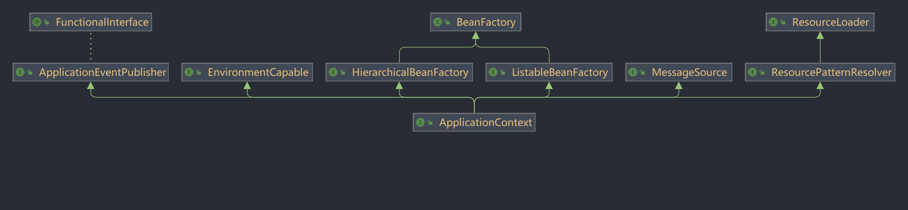

<!-- TOC -->
- [一. Spring系统架构](#一-spring系统架构)
- [二. IoC思想和DI(依赖注入) 目标: 充分解耦](#二-ioc思想和di依赖注入-目标-充分解耦)
  - [1. IoC思想 --- (Inversion of Control)控制反转](#1-ioc思想-----inversion-of-control控制反转)
  - [2. DI(依赖注入)](#2-di依赖注入)
  - [3. IoC 获取方法](#3-ioc-获取方法)
- [三. bean配置](#三-bean配置)
  - [1. bean基础配置:](#1-bean基础配置)
  - [2. bean的别名:](#2-bean的别名)
  - [3. bean的作用范围:](#3-bean的作用范围)
  - [4. bean的实例化](#4-bean的实例化)
  - [5. bean的生命周期](#5-bean的生命周期)
    - [详细生命周期](#详细生命周期)
- [四. 依赖注入方式](#四-依赖注入方式)
  - [1. setter注入](#1-setter注入)
  - [2. 构造器注入](#2-构造器注入)
  - [3. 依赖注入方式选择](#3-依赖注入方式选择)
  - [4. 依赖自动装配](#4-依赖自动装配)
  - [5. 集合注入](#5-集合注入)
- [五. 数据源对象管理(第三方资源配置管理)](#五-数据源对象管理第三方资源配置管理)
  - [1. 以阿里巴巴的druid数据源导入为例:](#1-以阿里巴巴的druid数据源导入为例)
  - [2. 以c3p0数据源导入为例](#2-以c3p0数据源导入为例)
  - [3. 加载Properties文件形式开启数据源(对druid源修改)](#3-加载properties文件形式开启数据源对druid源修改)
- [六. 容器](#六-容器)
  - [1. 创建容器](#1-创建容器)
  - [2. 获取bean](#2-获取bean)
  - [3. 容器类层次结构](#3-容器类层次结构)
  - [4. BeanFactory](#4-beanfactory)
<!-- TOC -->

# 一. Spring系统架构

1. Core Container: 核心容器 --- Beans Core Context SpEL
2. Data Access: 数据访问/Data Integration: 数据集成
3. AOP: 面向切面编程
4. Aspects: AOP思想实现
5. Transactions: 事务  (归于Data Access里)
6. Web: Web开发
7. Test: 单元测试与集成测试

# 二. IoC思想和DI(依赖注入) 目标: 充分解耦

## 1. IoC思想 --- (Inversion of Control)控制反转

对象的创建控制权由程序转移到外部
使用对象时, 程序不要主动使用new产生对象, 转换为由外部提供对象
Spring技术对Ioc思想进行了思想, 提供了一个IoC容器, 用来充当IoC思想的外部
IoC容器负责对象的创建, 初始化等一系列工作, 被创建或被管理的对象在IoC容器中统称为Bean

## 2. DI(依赖注入)

在容器中建立bean与bean之间的依赖关系的整个过程

最终效果: 使用对象时不仅可以直接从IoC容器中获取, 并且获取到的bean已经绑定了所有的依赖关系

## 3. IoC 获取方法

**配置**
**接口**
**接口方法**

# 三. bean配置

## 1. bean基础配置:

- bean标签表示配置bean
- id属性表示给bean起名字
- class属性表示给bean定义类型
- id不能重复

```xml

<bean id="bookDao" class="com.itstudy.dao.impl.BookDaoImpl"/>

<bean id="bookService" class="com.itstudy.service.impl.BookServiceImpl"/>
```

## 2. bean的别名:

通过bean标签的name属性可以起多个别名

```xml
    <bean id="bookService" name="service service01" class="com.itstudy.service.impl.BookServiceImpl"/>
```

## 3. bean的作用范围:

spring创造出的对象是单例的, 对象只有一个

```java
class App {
    public static void main(String[] args) {
        ApplicationContext ctx = new ClassPathXmlApplicationContext("applicationContext.xml");
        BookService bookService1 = (BookService) ctx.getBean("bookService");
        BookService bookService2 = (BookService) ctx.getBean("bookService");
        System.out.println(bookService1); //@865dd6
        System.out.println(bookService2); //@865dd6
    }
}
```

通过修改bean的scope属性 scope="prototype" 可以产生不同的对象@4da4253

```xml

<bean id="bookDao" class="com.itstudy.dao.impl.BookDaoImpl" scope="prototype"/>
```

为什么bean默认为单例呢?

- 多次创造对象会造成业务逻辑复杂, 对内存造成压力
- 单例适合业务运行时多次从容器里拿出同一bean对象, 用完就放回去, 减少内存的运行压力

**适合交给容器管理的bean**

- 表现层对象
- 业务层对象
- 数据层对象
- 工具对象

**不适合交给容器管理的bean**

- 封装实体的域对象

## 4. bean的实例化

(1) bean本质上是对象, spring内部通过反射来构造对应的bean对象, 如果bean对象只有有参构造方法,
spring构造会报BeanCreateException

- spring采用的是通过反射进行的无参构造
- 解决spring异常从异常底部开始解决, 大部分情况解决最底下的异常就能解决

(2)bean实例化--静态工厂

- 实例化工厂时必须实例化它的方法

```xml
<!--方法二: 使用静态工厂实例化bean-->
<bean id="orderDao" class="com.itstudy.factory.OrderDaoFactory" factory-method="getOrderDao"/>
```

(3)bean实例化--实例工厂

- 先实现实例工厂对象, 再实现实例工厂里的方法

```xml
<!--方法三: 使用实例工厂实例化bean-->
<bean id="userFactory" class="com.itstudy.factory.UseDaoFactory"/>
        <!--userFactory完全是配合使用, 实际无意义-->
<bean id="userDao" factory-bean="userFactory" factory-method="getUserDao"/>
- ```

(4)针对(3)实现的简单方法

- 新建一个UserDaoFactoryBean继承接口FactoryBean<T>, T为你要实现的类型

```java
public class UserDaoFactoryBean implements FactoryBean<UserDao> {
    //代替原始实例工厂中创建对象的方法
    @Override
    public UserDao getObject() throws Exception {
        return new UserDaoImpl();
    }
    //返回你要创造类的类型字节码class(一般接口的class)
    @Override
    public Class<?> getObjectType() {
        return UserDao.class;
    }
}
```

- 然后在application中配置一个Factory的bean就行

```xml
<!--方法四(方法三的变种)-->
<bean id="userDao" class="com.itstudy.factory.UserDaoFactoryBean"/>
```

- 实际新建出来的对象是getobject方法里实现出来的对象, 非工厂对象, FactoryBean是后期非常常用的一种构建bean的方法

## 5. bean的生命周期

- 生命周期: 从创建到消亡的过程
- bean生命周期: bean从创建到消亡的过程
- bean生命周期控制: 在bean创建后到销毁前做一些事情, 例如在bean创建之前进行数据的准备

(1)实现方式: 写好对应的初始化和销毁方法, 然后在配置文件中进行配置

```xml

<bean id="bookDao" class="com.itstudy.dao.impl.BookDaoImpl" init-method="init" destroy-method="destroy"/>
```

ClassPathXmlApplicationContext里存在暴力关闭的方法close(),建议采用关闭钩子的方法registerShutdownHook();后期web工程会应用到
这些方法均来自于ConfigurableApplicationContext接口

(2)spring提供的接口InitializingBean, DisposableBean里的方法,分别重写下面两个方法

```java
public class BookServiceImpl implements BookService, InitializingBean, DisposableBean {
    @Override
    public void destroy() throws Exception {
        System.out.println("service destroy");
    }

    @Override
    public void afterPropertiesSet() throws Exception {
        System.out.println("service init");
    }
}
```

配置好service bean对象后直接使用(不需要配init-method 和 destroy-method)

### 详细生命周期

1. 初始化容器

* 创建对象(内存分配)
* 执行构造方法
* 执行属性注入(set操作)
* 执行bean初始化方法

2. 使用bean

* 执行业务操作

3. 关闭/销毁容器

* 执行bean销毁方法

# 四. 依赖注入方式

1. 思考: 像一个类中传递数据的方式有几种?

* 普通方法(set方法)
* 构造方法

2. 思考: 依赖注入描述了在容器中建立了bean与bean之间依赖关系的过程, 如果bean运行需要的是数字或字符串呢?

* 引用类型
* 简单类型(基本类型与String)

3. 依赖注入方式:

- setter注入
    * 简单类型
    * 引用类型
- 构造器注入
    * 简单类型
    * 引用类型

## 1. setter注入

先编写好class类

```java
public class BookDaoImpl implements BookDao{
    private int connectionNum;
    private String databaseName;

    public void setConnectionNum(int connectionNum) {
        this.connectionNum = connectionNum;
    }

    public void setDatabaseName(String databaseName) {
        this.databaseName = databaseName;
    }

    @Override
    public void save() {
        System.out.println("book dao save..." + databaseName + ", " + connectionNum);
    }
}
```

再在配置文件里配置bean

```xml

<bean id="bookDao" class="com.itstudy.dao.impl.BookDaoImpl">
    <property name="databaseName" value="mysql"/>
    <property name="connectionNum" value="10"/>
</bean>
<bean id="userDao" class="com.itstudy.dao.impl.UserDaoImpl"/>
<bean id="bookService" class="com.itstudy.service.impl.BookServiceImpl">
<property name="bookDao" ref="bookDao"/>
<property name="userDao" ref="userDao"/>
</bean>
```

最后通过获取容器进行程序运行

```java
public class AppForDISet {
    public static void main(String[] args) {
        ClassPathXmlApplicationContext ctx = new ClassPathXmlApplicationContext("applicationContext.xml");
        BookService bookService = (BookService) ctx.getBean("bookService");
        bookService.save();
    }
}
```

运行结果:

```
book dao save...mysql, 10
```

## 2. 构造器注入

编写class类

```java
public class BookServiceImpl implements BookService {

    private BookDao bookDao;

    public BookServiceImpl(BookDao bookDao) {
        this.bookDao = bookDao;
    }

    @Override
    public void save() {
        System.out.println("book service save...");
        bookDao.save();
    }
}
```

配置bean属性, 绑定构造器的使用 constructor-arg 标签, 绑定setter的使用 property 标签

```xml
    <bean id="bookDao" class="com.itstudy.dao.impl.BookDaoImpl"/>

    <bean id="bookService" class="com.itstudy.service.impl.BookServiceImpl">
        <constructor-arg name="bookDao" ref="bookDao"/>
    </bean>
```

ref链接的是 bean id="bookDao", name链接的是 private BookDao bookDao;

简单类型的注入类似, 只展示xml文件

```xml

<bean id="bookDao" class="com.itstudy.dao.impl.BookDaoImpl">
    <constructor-arg name="databaseName" value="mysql"/>
    <constructor-arg name="connectionNum" value="666"/>
</bean>
```

结果如下:

```
book service save...
book dao save...mysql, 666
User Dao save...
```

但是上面的这种写法在类型名称变化时配置文件也要更改bean的name属性, 耦合度大, 所以还有一种解耦方式的写法, 就是利用参数的类型type来配置

```xml

<bean id="bookDao" class="com.itstudy.dao.impl.BookDaoImpl">
    <constructor-arg type="java.lang.String" value="mysql"/>
    <constructor-arg type="int" value="666"/>
</bean>

<bean id="userDao" class="com.itstudy.dao.impl.UserDaoImpl"/>

<bean id="bookService" class="com.itstudy.service.impl.BookServiceImpl">
<constructor-arg type="com.itstudy.dao.BookDao" ref="bookDao"/>
<constructor-arg type="com.itstudy.dao.UserDao" ref="userDao"/>
</bean>
```

但是这种写法还是有弊端, 在多个相同类型的参数下无效, 究极方式就是利用构造器中的参数顺序来辨别

```xml

<bean id="bookDao" class="com.itstudy.dao.impl.BookDaoImpl">
    <constructor-arg index="0" value="666"/>
    <constructor-arg index="1" value="mysql"/>
</bean>

<bean id="userDao" class="com.itstudy.dao.impl.UserDaoImpl"/>

<bean id="bookService" class="com.itstudy.service.impl.BookServiceImpl">
<constructor-arg index="0" ref="bookDao"/>
<constructor-arg index="1" ref="userDao"/>
</bean>
```

以上各种方式运行的结果在简单基础上都一样, 复杂的参数可能只有利用参数顺序的方式才能实现

## 3. 依赖注入方式选择

1. 强制依赖使用构造器进行，使用setter注入有概率不进行注入导致null对象出现
    * 强制依赖指对象在创建的过程中必须要注入指定的参数
2. 可选依赖使用setter注入进行，灵活性强
    * 可选依赖指对象在创建过程中注入的参数可有可无
3. Spring框架倡导使用构造器，第三方框架内部大多数采用构造器注入的形式进行数据初始化，相对严谨
4. 如果有必要可以两者同时使用，使用构造器注入完成强制依赖的注入，使用setter注入完成可选依赖的注入
5. 实际开发过程中还要根据实际情况分析，如果受控对象没有提供setter方法就必须使用构造器注入
6. **"自己开发的模块推荐使用setter注入"**

## 4. 依赖自动装配

IoC容器根据bean所依赖的资源在容器中自动查找并注入到bean中的过程称为自动装配

自动装配的方式

- 按类型(常用)
- 按名称
- 按构造方法
- 不启用自动装配

只需要更改xml配置文件, 改个autowire属性

```xml

<bean id="bookDao" class="com.itstudy.dao.impl.BookDaoImpl"/>

<bean id="bookService" name="service service2 serviceEBI" class="com.itstudy.service.impl.BookServiceImpl"
      autowire="byType"/>
```

按类型装配依赖的那个bean的id都可以不写

**依赖自动装配的特征**

1. 自动装配用于引用类型依赖注入，不能对简单类型进行操作
2. 使用按类型装配时（byType）必须保障容器中相同类型的bean唯一，推荐使用
3. 使用按名称装配时（byName）必须保障容器中具有指定名称的bean，因变量名与配置耦合，不推荐使用
4. 自动装配优先级低于setter注入与构造器注入，同时出现时自动装配配置失效

## 5. 集合注入

class文件编写:

```java
public class BookDaoImpl implements BookDao {
    private int[] array;
    private List<String> list;
    private Set<String> set;
    private Map<String, String> map;
    private Properties properties;

    public void setArray(int[] array) {
        this.array = array;
    }

    public void setList(List<String> list) {
        this.list = list;
    }

    public void setSet(Set<String> set) {
        this.set = set;
    }

    public void setMap(Map<String, String> map) {
        this.map = map;
    }

    public void setProperties(Properties properties) {
        this.properties = properties;
    }

    @Override
    public void save() {
        System.out.println("book dao save...");

        System.out.println("遍历数组" + Arrays.toString(array));
        System.out.println("遍历List" + list);
        System.out.println("遍历Set" + set);
        System.out.println("遍历Map" + map);
        System.out.println("遍历Properties" + properties);
    }
}
```

xml文件配置:

```xml

<bean id="bookDao" class="com.itstudy.dao.impl.BookDaoImpl">
    <property name="array">
        <array>
            <value>100</value>
            <value>200</value>
            <value>300</value>
        </array>
    </property>
    <property name="list">
        <list>
            <value>tom</value>
            <value>alen</value>
            <value>jack</value>
        </list>
    </property>
    <property name="set">
        <set>
            <value>tom</value>
            <value>alen</value>
            <value>jack</value>
            <value>jack</value>
        </set>
    </property>
    <property name="map">
        <map>
            <entry key="tom" value="上海"/>
            <entry key="alen" value="北京"/>
            <entry key="jack" value="广州"/>
        </map>
    </property>
    <property name="properties">
        <props>
            <prop key="country">china</prop>
            <prop key="province">jiangsu</prop>
            <prop key="city">nanjing</prop>
        </props>
    </property>
</bean>
```

运行结果:

```
book dao save...
遍历数组[100, 200, 300]
遍历List[tom, alen, jack]
遍历Set[tom, alen, jack]
遍历Map{tom=上海, alen=北京, jack=广州}
遍历Properties{country=china, province=jiangsu, city=nanjing}
```

# 五. 数据源对象管理(第三方资源配置管理)

## 1. 以阿里巴巴的druid数据源导入为例:

首先导入阿里云的druid数据源, 配置pom.xml

```xml

<dependency>
    <groupId>com.alibaba</groupId>
    <artifactId>druid</artifactId>
    <version>1.2.18</version>
</dependency>
```

编写class文件

```java
public class App {
    public static void main(String[] args) {
        ApplicationContext ctx = new ClassPathXmlApplicationContext("applicationContext.xml");
        DataSource dataSource = (DataSource) ctx.getBean("dataSource");
        System.out.println(dataSource);
    }
}
```

配置applicationContext.xml

```xml
<!--管理DruidDataSource对象-->
<bean id="dataSource" class="com.alibaba.druid.pool.DruidDataSource">
    <property name="driverClassName" value="com.mysql.jdbc.Driver"/>
    <property name="url" value="jdbc:mysql://localhost:3306/Mydatabase"/>
    <property name="username" value="root"/>
    <property name="password" value="root"/>
</bean>
```

结果:

```
{
	CreateTime:"2023-06-02 16:34:48",
	ActiveCount:0,
	PoolingCount:0,
	CreateCount:0,
	DestroyCount:0,
	CloseCount:0,
	ConnectCount:0,
	Connections:[
	]
}
```

## 2. 以c3p0数据源导入为例

首先导入c3p0数据源, 配置pom.xml

```xml

<dependency>
    <groupId>c3p0</groupId>
    <artifactId>c3p0</artifactId>
    <version>0.9.1.2</version>
</dependency>
```

编写class文件

```java
public class App {
    public static void main(String[] args) {
        ApplicationContext ctx = new ClassPathXmlApplicationContext("applicationContext.xml");
        DataSource dataSource = (DataSource) ctx.getBean("dataSource");
        System.out.println(dataSource);
    }
}
```

配置applicationContext.xml

```xml
<!--c3p0数据源-->
<bean id="dataSource" class="com.mchange.v2.c3p0.ComboPooledDataSource">
    <property name="driverClass" value="com.mysql.jdbc.Driver"/>
    <property name="jdbcUrl" value="jdbc:mysql://localhost:3306/Mydatabase"/>
    <property name="user" value="root"/>
    <property name="password" value="root"/>
</bean>
```

运行前导入下jdbc的坐标

```xml

<dependency>
    <groupId>mysql</groupId>
    <artifactId>mysql-connector-java</artifactId>
    <version>8.0.28</version>
</dependency>

```

结果:

```
6月 02, 2023 4:48:29 下午 com.mchange.v2.log.MLog <clinit>
信息: MLog clients using java 1.4+ standard logging.
6月 02, 2023 4:48:30 下午 com.mchange.v2.c3p0.C3P0Registry banner
信息: Initializing c3p0-0.9.1.2 [built 21-May-2007 15:04:56; debug? true; trace: 10]
6月 02, 2023 4:48:30 下午 com.mchange.v2.c3p0.impl.AbstractPoolBackedDataSource getPoolManager
信息: Initializing c3p0 pool... com.mchange.v2.c3p0.ComboPooledDataSource [ acquireIncrement -> 3, acquireRetryAttempts -> 30, acquireRetryDelay -> 1000, autoCommitOnClose -> false, automaticTestTable -> null, breakAfterAcquireFailure -> false, checkoutTimeout -> 0, connectionCustomizerClassName -> null, connectionTesterClassName -> com.mchange.v2.c3p0.impl.DefaultConnectionTester, dataSourceName -> 1b618bzawy7jrdatws626|59af0466, debugUnreturnedConnectionStackTraces -> false, description -> null, driverClass -> com.mysql.jdbc.Driver, factoryClassLocation -> null, forceIgnoreUnresolvedTransactions -> false, identityToken -> 1b618bzawy7jrdatws626|59af0466, idleConnectionTestPeriod -> 0, initialPoolSize -> 3, jdbcUrl -> jdbc:mysql://localhost:3306/Mydatabase, maxAdministrativeTaskTime -> 0, maxConnectionAge -> 0, maxIdleTime -> 0, maxIdleTimeExcessConnections -> 0, maxPoolSize -> 15, maxStatements -> 0, maxStatementsPerConnection -> 0, minPoolSize -> 3, numHelperThreads -> 3, numThreadsAwaitingCheckoutDefaultUser -> 0, preferredTestQuery -> null, properties -> {password=******, user=******}, propertyCycle -> 0, testConnectionOnCheckin -> false, testConnectionOnCheckout -> false, unreturnedConnectionTimeout -> 0, usesTraditionalReflectiveProxies -> false ]
com.mchange.v2.c3p0.ComboPooledDataSource [ acquireIncrement -> 3, acquireRetryAttempts -> 30, acquireRetryDelay -> 1000, autoCommitOnClose -> false, automaticTestTable -> null, breakAfterAcquireFailure -> false, checkoutTimeout -> 0, connectionCustomizerClassName -> null, connectionTesterClassName -> com.mchange.v2.c3p0.impl.DefaultConnectionTester, dataSourceName -> 1b618bzawy7jrdatws626|59af0466, debugUnreturnedConnectionStackTraces -> false, description -> null, driverClass -> com.mysql.jdbc.Driver, factoryClassLocation -> null, forceIgnoreUnresolvedTransactions -> false, identityToken -> 1b618bzawy7jrdatws626|59af0466, idleConnectionTestPeriod -> 0, initialPoolSize -> 3, jdbcUrl -> jdbc:mysql://localhost:3306/Mydatabase, maxAdministrativeTaskTime -> 0, maxConnectionAge -> 0, maxIdleTime -> 0, maxIdleTimeExcessConnections -> 0, maxPoolSize -> 15, maxStatements -> 0, maxStatementsPerConnection -> 0, minPoolSize -> 3, numHelperThreads -> 3, numThreadsAwaitingCheckoutDefaultUser -> 0, preferredTestQuery -> null, properties -> {password=******, user=******}, propertyCycle -> 0, testConnectionOnCheckin -> false, testConnectionOnCheckout -> false, unreturnedConnectionTimeout -> 0, usesTraditionalReflectiveProxies -> false ]

```

## 3. 加载Properties文件形式开启数据源(对druid源修改)

新建jdbc.Properties文件

```properties
jdbc.driver=com.mysql.jdbc.Driver
jdbc.username=root
jdbc.password=root
jdbc.url=jdbc:mysql://localhost:3306/Mydatabase
```

配置applicationContext.xml文件, 同时要开一个新的spring命名空间context

```xml
<?xml version="1.0" encoding="UTF-8"?>
<beans xmlns="http://www.springframework.org/schema/beans"
       xmlns:xsi="http://www.w3.org/2001/XMLSchema-instance"
       xmlns:context="http://www.springframework.org/schema/context"

       xsi:schemaLocation="
       http://www.springframework.org/schema/beans
       http://www.springframework.org/schema/beans/spring-beans.xsd
       http://www.springframework.org/schema/context
       http://www.springframework.org/schema/context/spring-context.xsd">

    <!--加载jdbc配置文件的形式-->
    <!--1, 开启context命名空间-->
    <!--2, 使用context命名空间加载jdbc.properties文件-->
    <!--注意: system-properties-mode="NEVER"表示不加载系统的环境变量-->
    <!--加载多个 location="jdbc.properties, jdbc2.properties" 或者 location="*.properties"-->
    <!--最专业的写法 location="classpath:*.properties"-->
    <!--加载类路径或者jar包里的配置文件写法 location="classpath*:*.properties" 加载块里全部的配置文件-->
    <context:property-placeholder location="classpath*:*.properties" system-properties-mode="NEVER"/>

    <bean id="dataSource" class="com.alibaba.druid.pool.DruidDataSource">
        <property name="driverClassName" value="${jdbc.driver}"/>
        <property name="url" value="${jdbc.url}"/>
        <property name="username" value="${jdbc.username}"/>
        <property name="password" value="${jdbc.password}"/>
    </bean>


</beans>
```

# 六. 容器

## 1. 创建容器

```
//1. 加载类路径下的配置文件
ApplicationContext ctx = new ClassPathXmlApplicationContext("applicationContext.xml");
//2. 绝对路径或者相对路径下的配置文件
ApplicationContext ctx2 = new FileSystemXmlApplicationContext("SpringDemo09\\src\\main\\resources\\applicationContext.xml");
  
```

## 2. 获取bean

```
//1, 强转类型获取容器
BookService bookService = (BookService) ctx.getBean("bookService");
//2, 附加文件类型字节码文件获取bean
BookService bookService2 = ctx2.getBean("bookService", BookService.class);
//3, 直接指定文件类型字节码文件获取bean, 局限性在于只能由一个BookService类型的容器
BookService bookService3 = ctx2.getBean(BookService.class);
```

## 3. 容器类层次结构


## 4. BeanFactory
```java
public class AppForBeanFactory {
    public static void main(String[] args) {
        Resource resources = new ClassPathResource("applicationContext.xml");
        BeanFactory bf = new XmlBeanFactory(resources);
        BookDao bookDao = bf.getBean(BookDao.class);
        bookDao.save();
    }
}
```
BeanFactory在初始化的bean时有延迟加载构造器的特性, 而ApplicationContext初始化bean是立即加载构造器,
也可以通过修改bean属性的 lazy-init="true" 来实现延迟加载
___

